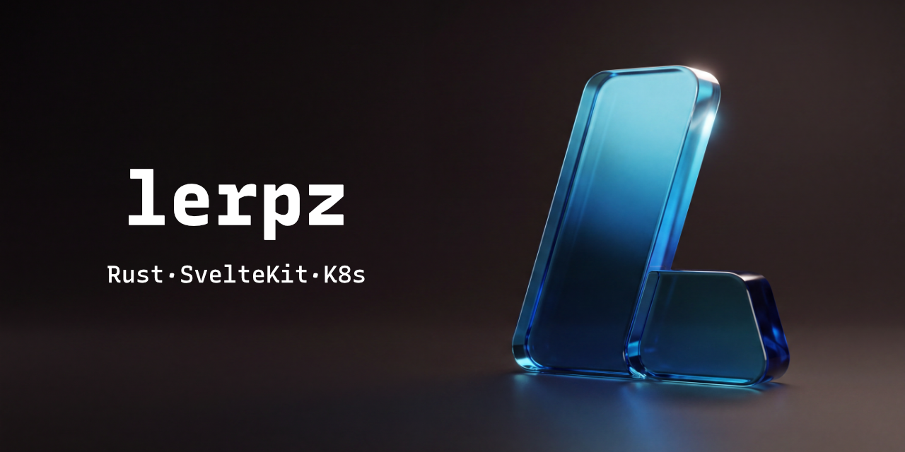

<p align="center">
    <a href="https://github.com/kanerix/lerpz-com/actions"></a>
    &nbsp;
    <a href="https://github.com/kanerix/lerpz-com"></a>
    &nbsp;
    <a href="https://github.com/kanerix/lerpz-com"></a>
    &nbsp;
    <a href="https://lerpz.com"></a>
</p>

<br>

## What is Lerpz?

A monorepo containing shared libraries, services, and packages for the Lerpz
platform — an internal enterprise AI portal that provides chat interfaces, user
management, and organizational tools, all backed by Microsoft Entra ID
authentication.

Everything lives in one repository: two SvelteKit frontends, three Rust
services, the shared crates and packages they depend on, the Kubernetes and
Terraform definitions they deploy to, and the migrations that back them.

## Contents

- [Services](#services)
- [Architecture](#architecture)
- [Repository layout](#repository-layout)
- [Getting started](#getting-started)
- [Configuration](#configuration)
- [Running the stack](#running-the-stack)
- [Database](#database)
- [Development](#development)
- [Deployment](#deployment)
- [Documentation](#documentation)

## Services

| Name | Role | Stack | Port |
|---|---|---|---|
| `www` | Company / landing site | SvelteKit (static) | 3000 |
| `app` | Product UI | SvelteKit | 3001 |
| `api` | Backend API | Rust / Axum | 4000 |
| `artoo` | In-app assistant | Rust | 4001 |
| `forge` | Agent infrastructure provisioner | Rust / Axum / kube | 5000 |
| `qdrant` | Vector database | Qdrant | 6333 / 6334 |
| `postgres` | Primary database | PostgreSQL | 6432 |
| `dragonfly` | Cache | Dragonfly (Redis-compatible) | 6379 |
| `minio` | Object storage | MinIO | 6000 / 6001 |

Ports 3000–3999 are web pages, 4000–4999 are publicly reachable APIs, 5000–5999
are internal services, and 6000–6999 is third-party infrastructure. The
infrastructure ports above are what you connect to **from your machine**;
in-network those containers keep their vendor defaults (`postgres:5432`,
`minio:9000`). See [docs/NAMING.md](docs/NAMING.md) for the naming rules and the
conventions for adding a new service.

## Architecture

How requests flow through the platform:

```mermaid
flowchart TD
    Browser --> www
    Browser --> app
    Browser -->|OAuth2 / OIDC| entra[Entra ID]

    app --> api
    app -.->|not wired yet| artoo

    api --> postgres[(postgres)]
    api --> dragonfly[(dragonfly)]
    api --> minio[(minio)]
    api --> portkey[Portkey]

    artoo --> postgres
    artoo --> qdrant[(qdrant)]
    artoo --> portkey
    artoo --> graph[Microsoft Graph]

    forge --> kubernetes[Kubernetes API]
```

`artoo` is the app's main agent: it answers questions and helps users find
their way around the product's features. The product UI does not call it yet.

`api`, `artoo` and `forge` each validate Entra ID tokens on their own and never
call one another — the browser holds the token and talks to each directly.
Model traffic goes through [Portkey](https://portkey.ai) rather than to a
provider directly. `www` is fully static and depends on nothing. `forge` talks
to a cluster rather than to the local infrastructure, which is why it sits
behind its own compose profile.

## Repository layout

```
svc/          Deployable services (www, app, api, artoo, forge)
crates/       Shared Rust crates
packages/     Shared TypeScript packages
migrations/   sqlx migrations
k8s/          Kubernetes manifests and a kind cluster
terraform/    Infrastructure definitions
benchmarks/   Criterion benchmarks
docs/         Conventions and design notes
```

Shared Rust crates: `lerpz-ai`, `lerpz-axum`, `lerpz-jwt`, `lerpz-macros`,
`lerpz-metadata`, `lerpz-pwd`, `lerpz-utils`.

Shared TypeScript packages: `@lerpz/ui`, `@lerpz/biome-config`,
`@lerpz/typescript-config`.

## Getting started

### Prerequisites

- [Rust](https://rustup.rs/) (edition 2024)
- [Bun](https://bun.sh/) >= 1.4
- [Docker](https://www.docker.com/) & Docker Compose
- [just](https://github.com/casey/just) (optional, but every command below assumes it)

### Quick start

```sh
bun install
just dev
```

`just dev` starts the infrastructure containers, waits for them to become
healthy, then runs `api`, `artoo`, `app` and `www` on the host. One Ctrl-C
stops everything.

Run `just` on its own to list every recipe.

## Configuration

### 1. Configure Microsoft Entra ID

- Register an app in Azure Entra ID.
- Select **ID tokens (used for implicit and hybrid flows)**.
- Add the following redirect URI:

```bash
http://localhost:3001/api/auth/callback/microsoft-entra-id
# or
https://app.lerpz.local/api/auth/callback/microsoft-entra-id
```

### 2. Generate TLS certificates (for traefik)

Use mkcert to create local certificates:

```sh
mkcert -cert-file certs/cert.pem -key-file certs/key.pem \
  lerpz.local www.lerpz.local app.lerpz.local api.lerpz.local agent.lerpz.local
```

### 3. Update your hosts file (for traefik)

Add these entries to `/etc/hosts`:

```
127.0.0.1 lerpz.local www.lerpz.local app.lerpz.local api.lerpz.local agent.lerpz.local
```

## Running the stack

### Default mode (local development)

Start only the infrastructure services. If you followed the Traefik steps,
requests will be proxied to apps running on your local machine
(`localhost:3001` for `app`, `localhost:4000` for `api`):

```sh
just infra
```

Individual services can then be started on their own:

```sh
just www      # http://localhost:3000
just app      # http://localhost:3001
just api      # http://localhost:4000  (docs at /scalar)
just artoo    # http://localhost:4001  (docs at /scalar)
```

### Full mode (everything containerized)

Build and start every service in Docker:

```sh
just up
just down     # stop and remove, keeping volumes
```

### Forge

`forge` provisions agent infrastructure through the Kubernetes API, so it has no
self-contained local mode and sits behind its own profile:

```sh
just forge                              # on the host
docker compose --profile k8s up forge   # in a container
```

It mounts `~/.kube` read-only and exits on startup if no cluster answers. Because
a kind/minikube kubeconfig points at `127.0.0.1` — which inside the container is
the container itself — running `forge` in the kind cluster under [`k8s/`](k8s)
is usually the better path. See [k8s/README.md](k8s/README.md).

## Database

The project uses PostgreSQL with migrations managed by
[sqlx](https://github.com/launchbadge/sqlx). The schema includes tables for
conversations and messages supporting the AI chat feature.

```sh
just migrate            # apply pending migrations
just migration NAME     # create a new timestamped migration
just prepare            # regenerate the offline .sqlx cache
just psql               # open a shell against the running container
```

Compile-time query checks run offline by default, against the cached metadata in
`.sqlx`. Regenerate it with `just prepare` whenever a query changes.

## Development

| Command | Does |
|---|---|
| `just check` | Clippy, svelte-check and biome |
| `just fmt` | Format Rust and TypeScript in place |
| `just test` | Cargo test suite |
| `just bench` | Criterion benchmarks |
| `just build` | Release-build every service |
| `just openapi` | Regenerate the app's API client from `api`'s OpenAPI spec |
| `just logs` | Tail container logs |
| `just k8s` | Delegate to [k8s/justfile](k8s/justfile) |

## Deployment

| Workflow | Deploys |
|---|---|
| [`pipeline.yaml`](.github/workflows/pipeline.yaml) | Detects changed services and fans out to the others |
| [`deploy-container.yaml`](.github/workflows/deploy-container.yaml) | `app`, `api`, `artoo`, `forge` as containers |
| [`deploy-gh-page.yaml`](.github/workflows/deploy-gh-page.yaml) | `www` to GitHub Pages |

Only changed services are deployed, and `www` publishes from `main` only. The
container deploy jobs are currently commented out in `pipeline.yaml`, so `www`
is the only service the pipeline actually ships.

## Documentation

- [docs/NAMING.md](docs/NAMING.md) — service naming and port conventions
- [docs/INFRA.md](docs/INFRA.md) — infrastructure
- [docs/DATABASE.md](docs/DATABASE.md) — database design
- [docs/GUID.md](docs/GUID.md) — identifiers
