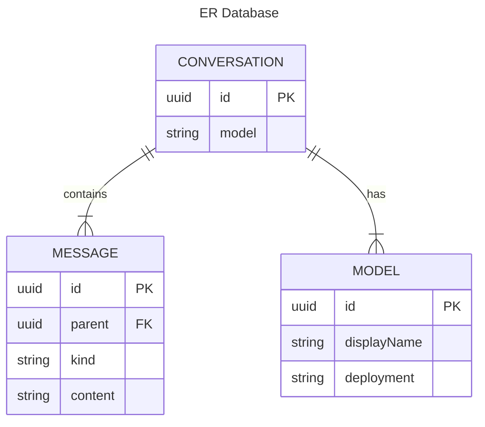

# Database

This document describes the layout of the database.

```mermaid
---
title: ER Database
---
erDiagram
    CONVERSATION ||--|{ MESSAGE : contains
    CONVERSATION ||--|{ MODEL : has
    MODEL {
        uuid id PK
        string displayName
        string deployment
    }
    CONVERSATION {
        uuid id PK
        string model
    }
    MESSAGE {
        uuid id PK
        uuid parent FK
        string kind
        string content
    }
```
