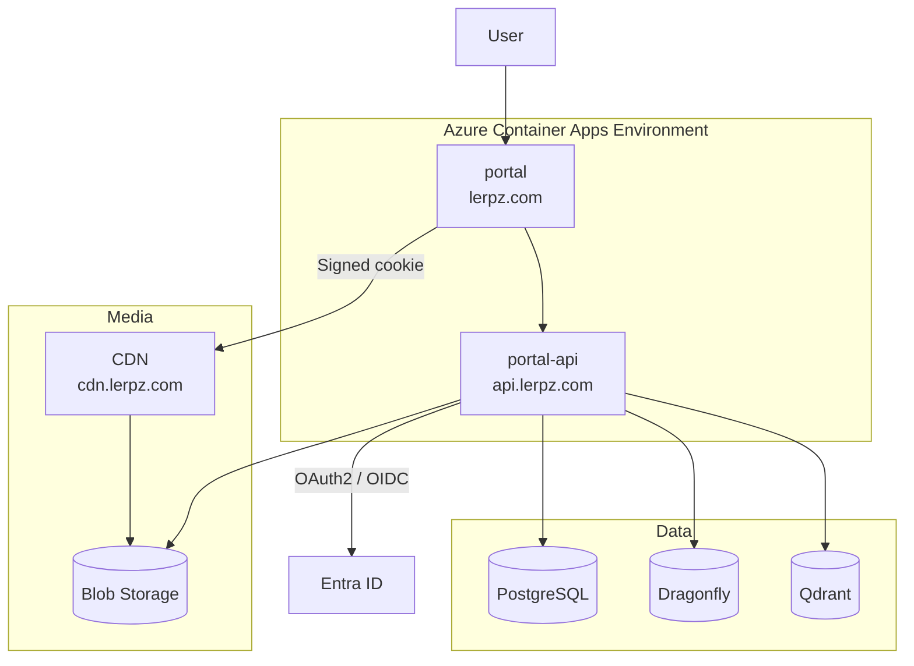
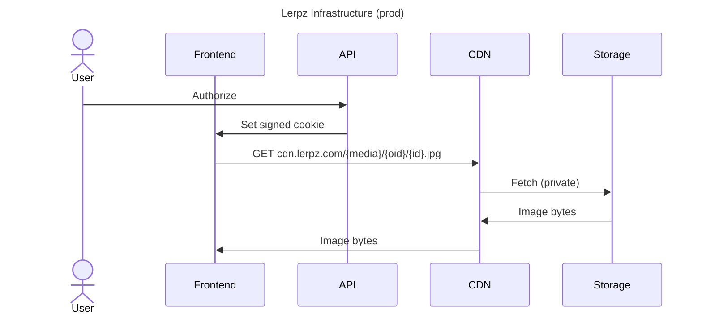

# Infrastructure

This document describes the infrastructure used by the Lerpz platform.

## Overview

```mermaid
graph TD
    User:::accent0

    subgraph aca[Azure Container Apps Environment]
        Portal[portal\nlerpz.com]:::accent1
        PortalAPI[portal-api\napi.lerpz.com]:::accent2
    end

    subgraph data[Data]
        Postgres[(PostgreSQL)]:::accent5
        Dragonfly[(Dragonfly)]:::accent5
        Qdrant[(Qdrant)]:::accent5
    end

    subgraph media[Media]
        CDN[CDN\ncdn.lerpz.com]:::accent4
        Storage[(Blob Storage)]:::accent5
    end

    EntraID[Entra ID]:::accent6

    User --> Portal
    Portal -->|Signed cookie| CDN
    Portal --> PortalAPI
    PortalAPI --> Postgres
    PortalAPI --> Dragonfly
    PortalAPI --> Qdrant
    PortalAPI --> Storage
    PortalAPI -->|OAuth2 / OIDC| EntraID
    CDN -->Storage
```

## User Media Flow

```mermaid
---
title: Lerpz Infrastructure (prod)
---
sequenceDiagram
    actor User
    participant Frontend
    participant API
    participant CDN
    participant Storage

    User->>API: Authorize
    API->>Frontend: Set signed cookie
    Frontend->>CDN: GET cdn.lerpz.com/{media}/{oid}/{id}.jpg
    CDN->>Storage: Fetch (private)
    Storage->>CDN: Image bytes
    CDN->>Frontend: Image bytes
```
