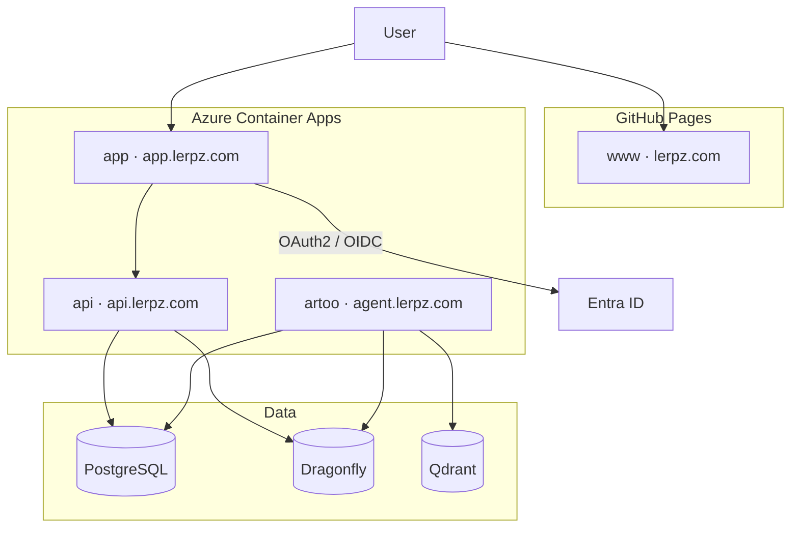
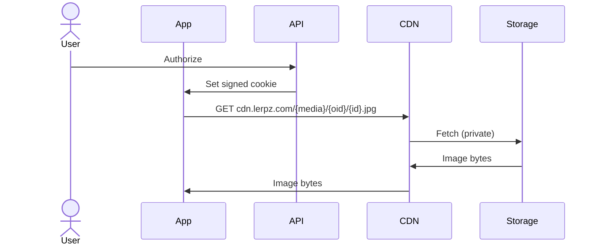

# Infrastructure

This document describes the infrastructure used by the Lerpz platform.

## Where each service runs

| Service | Target | Domain |
|---|---|---|
| `www` | GitHub Pages | `lerpz.com` |
| `app` | Azure Container Apps | `app.lerpz.com` |
| `api` | Azure Container Apps | `api.lerpz.com` |
| `artoo` | Azure Container Apps | `agent.lerpz.com` |
| `forge` | Kubernetes | internal |

`www` is fully static, so it is built by
[`deploy-gh-page.yaml`](../.github/workflows/deploy-gh-page.yaml) and published
to GitHub Pages rather than to a container. Everything else is built into an
image and pushed to the shared registry by
[`deploy-container.yaml`](../.github/workflows/deploy-container.yaml).

## Production topology

## Azure resources

Terraform is split into two states. `terraform/shared` holds what every
environment draws on:

- `azurerm_container_registry` — the shared ACR.
- `azurerm_storage_account` / `azurerm_storage_container` — remote state.
- `azurerm_user_assigned_identity.deployer` plus role assignments for state
  access and ACR push, federated to GitHub Actions so no secrets are stored.

`terraform/env` is applied once per environment:

- `azurerm_resource_group` — `lerpz-<env>-rg`.
- `azurerm_container_app_environment` — Consumption workload profile.
- `azurerm_container_app` — the app, scaling from zero to one replica at
  0.25 CPU / 0.5 Gi, with `template[0].container[0].image` ignored so
  deployments do not fight Terraform.
- `azurerm_container_app_custom_domain` and
  `azurerm_container_app_environment_managed_certificate` — hostname binding
  and the managed certificate.
- `azurerm_user_assigned_identity.runtime` with `AcrPull`, used to pull images.

Entra ID configuration and the public API URL are pushed into GitHub Actions
environment variables from `github.tf`, so the workflows stay free of
environment-specific values.

## Environments

| | Prod | Staging |
|---|---|---|
| Domain | `lerpz.com` | `stag.lerpz.com` |
| API | `api.lerpz.com` | `api.stag.lerpz.com` |
| Resource group | `lerpz-prod-rg` | `lerpz-stag-rg` |
| Container app | `lerpz-website-prod` | `lerpz-website-stag` |

Both share one ACR and one Entra ID app registration.

> [!NOTE]
> `terraform/env` still describes a single container app bound to the apex
> domain, from before `www` and `app` were separate services. The apex now
> serves `www` from GitHub Pages, so the custom domain in `locals.tf` needs to
> move to `app.lerpz.com`, and `api` needs a container app of its own.

## Kubernetes

[`k8s/`](../k8s) runs the whole stack on a local [kind](https://kind.sigs.k8s.io/)
cluster with Traefik as the ingress controller — the Kubernetes equivalent of
the root `docker-compose.yml`.

| Host | Service |
|---|---|
| `lerpz.local`, `www.lerpz.local` | `www` |
| `app.lerpz.local` | `app` |
| `api.lerpz.local` | `api` |
| `agent.lerpz.local` | `artoo` |

This is also the practical way to run `forge`, which provisions agent
infrastructure through the Kubernetes API and exits on startup if no cluster
answers. See [k8s/README.md](../k8s/README.md).

## Planned: user media delivery

Not yet provisioned. Object storage is MinIO locally; the CDN and blob storage
below have no Terraform resources yet.

