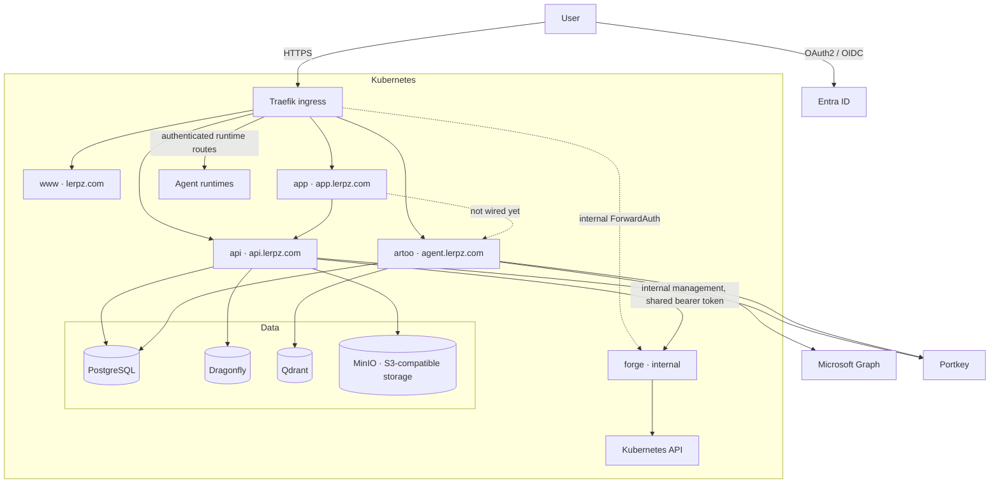
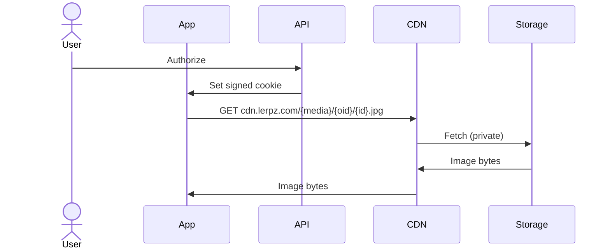

# Infrastructure

The target is Kubernetes for the whole Lerpz stack, as in [`k8s/`](../k8s),
not Azure Kubernetes Service (AKS) or Azure Container Apps.

## Where each service runs

| Service | Target     | Production domain |
| ------- | ---------- | ----------------- |
| `www`   | Kubernetes | `lerpz.com`       |
| `app`   | Kubernetes | `app.lerpz.com`   |
| `api`   | Kubernetes | `api.lerpz.com`   |
| `artoo` | Kubernetes | `agent.lerpz.com` |
| `forge` | Kubernetes | internal          |

> [!IMPORTANT]
> The production topology below is the target, not a claim about live deployments.
> [`pipeline.yaml`](../.github/workflows/pipeline.yaml) still sends `www` to
> GitHub Pages. Its `deploy-app`, `deploy-api`, `deploy-artoo` and `deploy-forge`
> jobs are commented out. The existing
> [`deploy-container.yaml`](../.github/workflows/deploy-container.yaml) targets
> Azure Container Apps, not Kubernetes, and needs replacing before those jobs
> are enabled. `www` also needs to move to the Kubernetes deployment path.

All five services have container images, including the static `www` site.
[`k8s/justfile`](../k8s/justfile) builds them and loads them directly into kind
for local development, without a registry. Production and staging need an
image registry and a Kubernetes deployment workflow.

`api.lerpz.com` can set host-only cookies by omitting `Domain`. These cookies
can accompany requests from the app to the API without being shared with the
app's hostname. `Domain=lerpz.com` shares a cookie across the parent domain and
all its subdomains; use it only when that broader scope is needed. The API
cannot set `Domain=app.lerpz.com`, which is a sibling domain. Use `Secure` and,
unless browser JavaScript needs to read the cookie, `HttpOnly`.

The app and API are same-site over HTTPS, but still cross-origin. Cookie-based
fetches need `credentials: "include"` and credential-enabled API CORS with an
explicit app origin and allowed headers. The current API CORS configuration
does not enable credentials. Agent management and runtime requests remain
bearer-token based with cookies omitted.

## Production topology

```mermaid
graph TD
    User

    subgraph k8s[Kubernetes]
        Traefik[Traefik ingress]
        www[www · lerpz.com]
        app[app · app.lerpz.com]
        api[api · api.lerpz.com]
        artoo[artoo · agent.lerpz.com]
        forge[forge · internal]
        Runtime[Agent runtimes]
        KubeAPI[Kubernetes API]

        subgraph data[Data]
            Postgres[(PostgreSQL)]
            Dragonfly[(Dragonfly)]
            Qdrant[(Qdrant)]
            Storage[(MinIO · S3-compatible storage)]
        end
    end

    EntraID[Entra ID]
    Graph[Microsoft Graph]
    Portkey[Portkey]

    User -->|HTTPS| Traefik
    Traefik --> www
    Traefik --> app
    Traefik --> api
    Traefik --> artoo
    Traefik -->|authenticated runtime routes| Runtime
    Traefik -.->|internal ForwardAuth| forge
    User -->|OAuth2 / OIDC| EntraID
    app --> api
    app -.->|not wired yet| artoo
    api -->|internal management, shared bearer token| forge
    api --> Postgres
    api --> Dragonfly
    api --> Storage
    api --> Portkey
    artoo --> Postgres
    artoo --> Qdrant
    artoo --> Portkey
    artoo --> Graph
    forge --> KubeAPI
```

Each Rust service validates Entra ID tokens through `lerpz-axum`'s Azure
middleware. For agent management, the browser calls the core API, which forwards
the caller's bearer token to Forge over an internal connection. API and Forge
must accept the same tenant and token audience. Forge validates that token and
enforces ownership through Kubernetes resource labels.

`artoo` is the app's main agent. It answers questions and helps users navigate
the product's features, grounding answers in a Qdrant collection rather than in
the model alone, and looking the signed-in user up through Microsoft Graph. All
model traffic, including chat, embeddings, image and video generation, is routed
through [Portkey](https://portkey.ai) as a gateway rather than to a provider
directly; `api` additionally holds Vertex AI configuration.

## Kubernetes resources

[`k8s/manifests/`](../k8s/manifests) is the local reference for the deployment
layout. It places the application and data workloads in the `lerpz` namespace:

- `apps/`: Deployments and internal Services for `www`, `app`, `api`, `artoo`
  and `forge`.
- `infra/`: StatefulSets, Services and persistent volume claims for PostgreSQL,
  Dragonfly, Qdrant and MinIO, plus a MinIO initialisation Job.
- `ingress/`: Traefik IngressRoutes for the public services, terminating TLS
  with the `lerpz-tls` Secret. Forge creates authenticated runtime routes
  dynamically and has no public management route.
- Per-service environment Secrets for `app`, `api`, `artoo` and `forge`.
  The static `www` site needs no environment configuration.
- Forge's ServiceAccount, namespaced Role and RoleBinding for managing runtime
  resources, plus NetworkPolicies restricting Forge and runtime ingress.

Traefik runs in its own namespace, installed with
[`k8s/traefik/values.yaml`](../k8s/traefik/values.yaml). Entra ID, Microsoft Graph
and Portkey remain external integrations, not workload hosting platforms.

## Local Kubernetes

[`k8s/`](../k8s) runs the whole stack on a local [kind](https://kind.sigs.k8s.io/)
cluster with Traefik as the ingress controller, the Kubernetes equivalent of
the root `docker-compose.yml`.

| Host                             | Service                              |
| -------------------------------- | ------------------------------------ |
| `lerpz.local`, `www.lerpz.local` | `www`                                |
| `app.lerpz.local`                | `app`                                |
| `api.lerpz.local`                | `api`                                |
| `agent.lerpz.local`              | `artoo`                              |
| `container.lerpz.local`          | Dynamic runtime Services, HTTPS only |

This is also the practical way to run `forge`, which provisions agent
infrastructure through the Kubernetes API and exits on startup if no cluster
answers. See [k8s/README.md](../k8s/README.md).

## Planned: user media delivery

`api` requires an S3 endpoint and will not start without one. MinIO supplies
that endpoint inside Kubernetes, at `http://minio:9000` in the local setup.
The manifests include its persistent storage and initialisation Job, but no
CDN or signed-cookie delivery configuration. The flow below remains planned.
API-only cookies do not cover `cdn.lerpz.com`; this flow needs a compatible
cookie scope or a separate cookie-setting design.

```mermaid
sequenceDiagram
    actor User
    participant App
    participant API
    participant CDN
    participant Storage

    User->>API: Authorize
    API->>App: Set signed cookie
    App->>CDN: GET cdn.lerpz.com/{media}/{oid}/{id}.jpg
    CDN->>Storage: Fetch (private)
    Storage->>CDN: Image bytes
    CDN->>App: Image bytes
```
